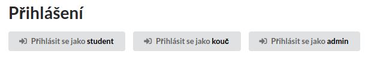

Pyladies Courseware
===================

Nástroj pro odevzdávání a review domácích úkolů z programování.

Todo
----

Next steps:

- dokončit workflow pro review úkolů
- nějak udělat notifikace
  - uvnitř aplikace
  - do Slacku
  - e-mail
  - debouncing (neposílat každou zvlášť, ale agregovat)
- někam to nasadit :)
- rozběhat FB a Google login
- přidat Github login
- dodělat admin uživatelů, ať se dají přiřazovat studenti a koučové do jednotlivých kurzů

Dlouhodoběji:

- odevzdávání přes Github

Viz také [issues](https://github.com/messa/pyladies-courseware/issues).

Pokud máte dotaz nebo chcete spustit diskuzi nad některým todo, založte issue (pokud už takové neexistuje).


Requirements
------------

- Node.js >= 8.0
- Python >= 3.6
  - Ubuntu: install also `python3-venv`
- MongoDB
- nginx


Local Development
-----------------

Ve 4 samostatných konzolích spusť:

```shell
$ make run-frontend
$ make run-backend
$ make run-mongod
$ make run-nginx
```

Otevři http://localhost:8000/

Na portu 8000 běží nginx reverse proxy
Na portu 3000 běží nodejs frontend.
Na portu 5000 běží aiohttp backend
Na portu 27017 běží MongoDB

Po změně kódu musíš restartovat příslušý proces.


Developer login
---------------

Pro usnadnění vývoje na localhostu, je možné (v defaultu automaticky) zapnout tlačítka přihlášení různých rolí.



Usage:

```shell
# in the backend directory
$ export ALLOW_DEV_LOGIN=1
$ make run-backend
```

Poznámky
--------

Nějaký pokus o přepsání domácích úkolů proběhl zde: https://github.com/pyvec/naucse.python.cz/pull/153
