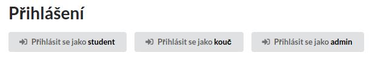

Pyladies Courseware
===================

Nástroj pro odevzdávání a review domácích úkolů z programování.

[](https://circleci.com/gh/messa/pyladies-courseware)

Production deployment: https://projekty.pyladies.cz/

Demo (reseted on every deploy): https://projekty-demo.messa.cz/


Todo
----

Next steps:

- dokončit workflow pro review úkolů
- ~rozběhat FB a Google login~
- přidat Github login
- ~někam to nasadit :)~
- udělat notifikace
  - uvnitř aplikace
  - do Slacku
  - e-mail
  - debouncing (neposílat každou zvlášť, ale agregovat)
- dodělat admin uživatelů, ať se dají přiřazovat studenti a koučové do jednotlivých kurzů

Dlouhodoběji:

- odevzdávání přes Github

Viz také [issues](https://github.com/messa/pyladies-courseware/issues).

Pokud máte dotaz nebo chcete spustit diskuzi nad některým todo, založte issue (pokud už takové neexistuje).


Architecture
------------

Uses React frontend based on [Next.js](https://github.com/zeit/next.js/) and Python backend based on [aiohttp.server](https://aiohttp.readthedocs.io/en/stable/).

```
browser --> nginx
              - /* ------------> node.js frontend
              - /api, /auth ---> Python aiohttp backend ---> MongoDB  
```

Why React:

- the site will be very dynamic, with complex forms, no-reload page updates, notifications etc. React enables to do this on client-side easily
- so far we keep the code as simple as possible - no redux, no graphql etc., just "classic" React component state

Why Next.js:

- handles all the boring stuff: webpack, routing, code splitting...
- we just write the React components, nothing else, no server-side code (except getInitialProps)
- we don't even use "nice" dynamic URLs to keep things as simple as possible
  - URL `/lesson?courseId=abc` is served from `pages/lesson.js` with `props: { query: { courseId: 'abc' }}`

Why Python backend:

- the language we all love :)
- libraries for everything
- more mature language for business logic and advanced I/O, process management etc.
- API backend is more responsive when the HTML server-rendering is outsourced to client process (or to static files)

Why aiohttp:

- supports websockets natively
- enables the server to be single-process, single-thread, so things like notification broadcasting become much easier
- powerful enough (just serves JSON API, no template rendering)
- the MongoDB asyncio client [motor](https://github.com/mongodb/motor) is a "first-class" MongoDB client library

Why MongoDB:

- provides all we need
- "operations friendly" - replication, migration etc. much easier than with *SQL
- MongoDB and its Python client [motor](https://github.com/mongodb/motor) provide nice asyncio API


Requirements
------------

- Node.js >= 10.0
- Python >= 3.6
  - Ubuntu: install also `python3-venv`
- MongoDB
  - via Docker: `docker run --rm -it -p 27017:27017 mongo:4`


Local Development
-----------------

Ve 3 samostatných konzolích spusť:

```shell
$ make run-mongod
$ make run-backend
$ make run-frontend
```

Otevři http://localhost:3000/

| Port  | Služba
|-------|-------
| 3000  | Node.js – frontend
| 5000  | aiohttp – backend
| 27017 | MongoDB

Při změně kódu Python backendu je potřeba restartovat proces (tj. znovu spustit `make run-backend`).
Pro automatizaci tohoto lze použít nějaký watchdog, např. [watch_files.py](https://github.com/messa/tools/blob/master/watch_files.py).


Developer login
---------------

Pro usnadnění vývoje na localhostu, je možné (v defaultu automaticky) zapnout tlačítka přihlášení různých rolí.



Usage:

```shell
# in the backend directory
$ export ALLOW_DEV_LOGIN=1
$ make run-backend
```


Project structure
-----------------

```
pyladies-courseware
├── Dockerfile
├── Makefile
├── backend
│   ├── Makefile
│   ├── cw_backend
│   │   ├── __init__.py
│   │   ├── __main__.py
│   │   ├── configuration.py
│   │   ├── courses.py
│   │   ├── main.py
│   │   ├── model
│   │   ├── util
│   │   └── views
│   ├── requirements-tests.txt
│   ├── requirements.txt
│   ├── setup.py
│   └── tests
│       ├── conftest.py
│       ├── data
│       ├── model
│       │   ├── test_users.py
│       │   └── ...
│       ├── ...
├── data - course, session and task data
├── frontend
│   ├── components
│   │   ├── ALink.js
│   │   ├── CodeEditor.js
│   │   ├── Header.js
│   │   ├── HomeworkComments.js
│   │   ├── ...
│   │   ├── admin
│   │   └── forms
│   ├── package-lock.json
│   ├── package.json
│   ├── pages
│   │   ├── admin
│   │   │   └── users.js
│   │   ├── course.js
│   │   ├── index.js
│   │   ├── lesson.js
│   │   ├── login.js
│   │   └── profile.js
│   ├── static
│   └── util
└── resources - images for README etc.
    └── local_dev_login.png
```


Poznámky
--------

Nějaký pokus o přepsání domácích úkolů proběhl zde: https://github.com/pyvec/naucse.python.cz/pull/153
